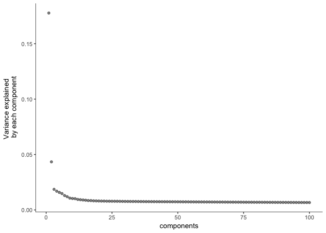
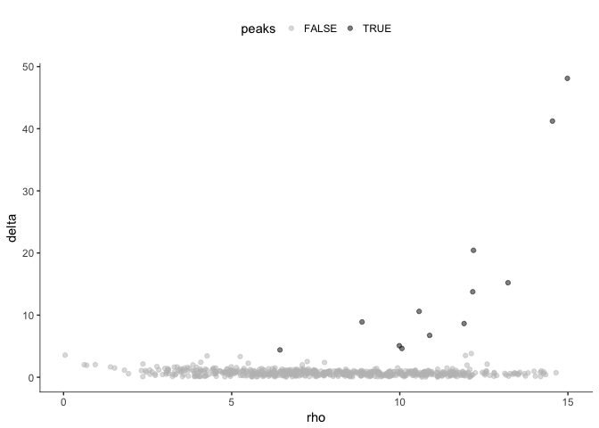
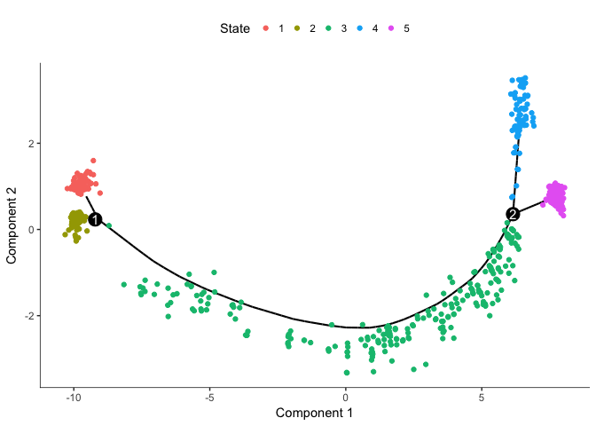
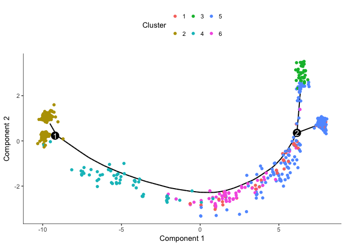
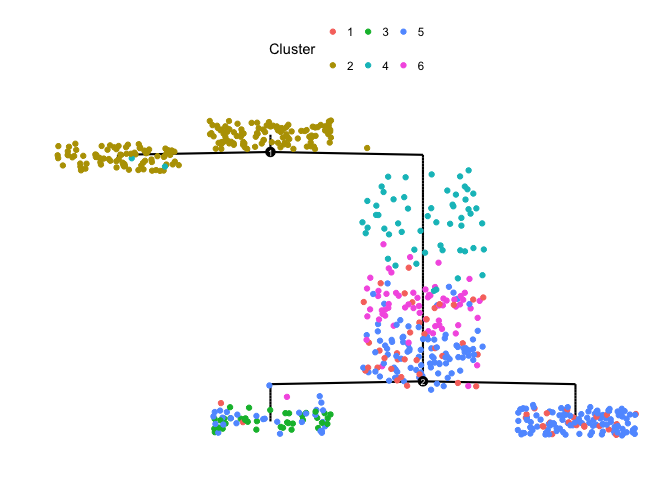
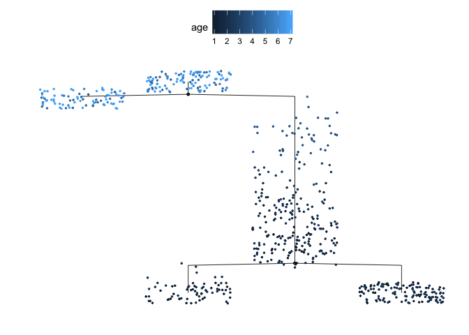
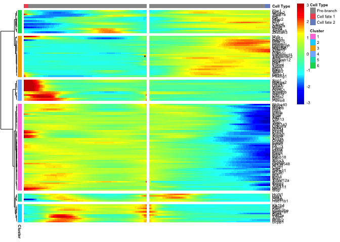
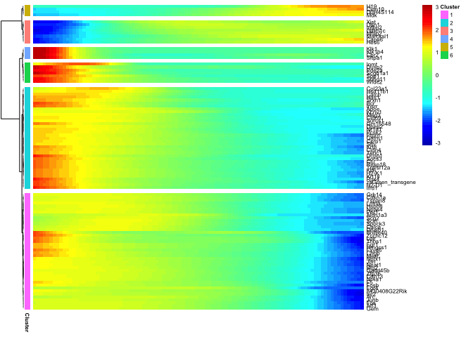

monoRunThrough
================
Lincoln Harris
2.13.18

**This is an example workbook for running Monocle for trajectory inference from single-cell RNA-seq data**

*I ran this on some lung neuroendocrine cells, hence the NE names associated with everything*

*A more detailed description of all of the steps demonstrated here can be found at:* <http://cole-trapnell-lab.github.io/monocle-release/docs/>

### Loading Data

Load library

``` r
library(monocle)
```

    ## Warning: package 'monocle' was built under R version 3.4.4

    ## Loading required package: Matrix

    ## Warning: package 'Matrix' was built under R version 3.4.4

    ## Loading required package: Biobase

    ## Loading required package: BiocGenerics

    ## Loading required package: parallel

    ## 
    ## Attaching package: 'BiocGenerics'

    ## The following objects are masked from 'package:parallel':
    ## 
    ##     clusterApply, clusterApplyLB, clusterCall, clusterEvalQ,
    ##     clusterExport, clusterMap, parApply, parCapply, parLapply,
    ##     parLapplyLB, parRapply, parSapply, parSapplyLB

    ## The following objects are masked from 'package:Matrix':
    ## 
    ##     colMeans, colSums, rowMeans, rowSums, which

    ## The following objects are masked from 'package:stats':
    ## 
    ##     IQR, mad, sd, var, xtabs

    ## The following objects are masked from 'package:base':
    ## 
    ##     anyDuplicated, append, as.data.frame, cbind, colMeans,
    ##     colnames, colSums, do.call, duplicated, eval, evalq, Filter,
    ##     Find, get, grep, grepl, intersect, is.unsorted, lapply,
    ##     lengths, Map, mapply, match, mget, order, paste, pmax,
    ##     pmax.int, pmin, pmin.int, Position, rank, rbind, Reduce,
    ##     rowMeans, rownames, rowSums, sapply, setdiff, sort, table,
    ##     tapply, union, unique, unsplit, which, which.max, which.min

    ## Welcome to Bioconductor
    ## 
    ##     Vignettes contain introductory material; view with
    ##     'browseVignettes()'. To cite Bioconductor, see
    ##     'citation("Biobase")', and for packages 'citation("pkgname")'.

    ## Loading required package: ggplot2

    ## Loading required package: VGAM

    ## Loading required package: stats4

    ## Loading required package: splines

    ## Loading required package: DDRTree

    ## Loading required package: irlba

Load data frames

``` r
raw_data <- read.csv('all_NE_raw.csv', header=TRUE)
row.names(raw_data) <- raw_data[,1]
raw_data <- raw_data[ ,-1]

meta_data <- read.csv('all_NE_meta.csv', header=TRUE)
row.names(meta_data) <- meta_data[,1]
meta_data <- meta_data[ ,-1]
```

Sanity check

``` r
dim(raw_data)
```

    ## [1] 17343   645

``` r
dim(meta_data)
```

    ## [1] 645   4

Create annotated data frame from meta\_data

``` r
meta_data_anno <- new("AnnotatedDataFrame", data = meta_data)
```

Create CellDataSet object

``` r
cds_NE <- newCellDataSet(cellData = as.matrix(raw_data), phenoData = meta_data_anno, featureData = NULL, expressionFamily = negbinomial.size())
```

    ## Warning in newCellDataSet(cellData = as.matrix(raw_data), phenoData =
    ## meta_data_anno, : Warning: featureData must contain a column verbatim named
    ## 'gene_short_name' for certain functions

    ## Warning in newCellDataSet(cellData = as.matrix(raw_data), phenoData =
    ## meta_data_anno, : Warning: featureData must contain a column verbatim named
    ## 'gene_short_name' for certain functions

    ## Warning in newCellDataSet(cellData = as.matrix(raw_data), phenoData =
    ## meta_data_anno, : Warning: featureData must contain a column verbatim named
    ## 'gene_short_name' for certain functions

Estimate size and dispersion

``` r
cds_NE <- estimateSizeFactors(cds_NE)
cds_NE <- estimateDispersions(cds_NE)
```

    ## Removing 249 outliers

### Constructing single-cell trajectories

Choosing genes that define progress, using *dpFeature* technique

``` r
cds_NE <- detectGenes(cds_NE, min_expr = 0.1)
fData(cds_NE)$use_for_ordering <- fData(cds_NE)$num_cells_expressed > 0.05 * ncol(cds_NE)
```

Find genes expressed in &gt;10 cells

``` r
all_NE_expressed_genes <- row.names(subset(fData(cds_NE), num_cells_expressed >= 10))
```

Plot PC variance

``` r
plot_pc_variance_explained(cds_NE, return_all = F, verbose = T, max_components = 100) 
```



Run dimensionality reduction

``` r
cds_NE <- reduceDimension(cds_NE, max_components = 2, norm_method = 'log', num_dim = 20, reduction_method = 'tSNE', verbose = T)
```

    ## Remove noise by PCA ...

    ## Reduce dimension by tSNE ...

Cluster cells & plot

``` r
cds_NE <- clusterCells(cds_NE, verbose = F)
```

    ## Distance cutoff calculated to 1.7319

``` r
plot_cell_clusters(cds_NE)
```


Refine clustering params

``` r
plot_rho_delta(cds_NE, rho_threshold = 2, delta_threshold = 4 )
```



...and recluster

``` r
cds_NE <- clusterCells(cds_NE, rho_threshold = 3, delta_threshold = 10, skip_rho_sigma = T, verbose = F)
plot_cell_clusters(cds_NE)
```


Differential gene expression test

``` r
clustering_DEG_genes_NE <- differentialGeneTest(cds_NE[all_NE_expressed_genes,], fullModelFormulaStr = '~Cluster')
```

Select top 1000 genes

``` r
all_NE_ordering_genes <- 
  row.names(clustering_DEG_genes_NE)[order(clustering_DEG_genes_NE$qval)][1:1000]

cds_NE <- setOrderingFilter(cds_NE, ordering_genes = all_NE_ordering_genes)
cds_NE <- reduceDimension(cds_NE, method = 'DDRTree')
cds_NE <- orderCells(cds_NE)
```

...And plot

``` r
plot_cell_trajectory(cds_NE, color_by = "State")
```



``` r
plot_cell_trajectory(cds_NE, color_by = "origin")
```


``` r
plot_cell_trajectory(cds_NE, color_by = "age")
```


``` r
plot_cell_trajectory(cds_NE, color_by = "Cluster")
```



A different way of plotting trajectories

``` r
# most basic case
plot_complex_cell_trajectory(cds_NE, color_by = 'Cluster')
```



``` r
plot_complex_cell_trajectory(cds_NE, color_by = 'State')
```


``` r
plot_complex_cell_trajectory(cds_NE, color_by = 'age')
```


``` r
# a bit more complicated
plot_complex_cell_trajectory(cds_NE, color_by = 'age', cell_size = 0.5, cell_link_size = 0.3) + scale_size(range = c(0.2, 0.2))
```



### BEAM Analysis

*BEAM (Branched Expression Analysis Modeling)* finds genes that drive the branching event at the specified branch point.

``` r
all_BEAM1 <- BEAM(cds_NE, branch_point = 1)
```

    ## Warning in if (progenitor_method == "duplicate") {: the condition has
    ## length > 1 and only the first element will be used

    ## Warning in if (progenitor_method == "sequential_split") {: the condition
    ## has length > 1 and only the first element will be used

    ## Warning in newCellDataSet(as.matrix(exprs_data), phenoData =
    ## new("AnnotatedDataFrame", : Warning: featureData must contain a column
    ## verbatim named 'gene_short_name' for certain functions

    ## Warning in newCellDataSet(as.matrix(exprs_data), phenoData =
    ## new("AnnotatedDataFrame", : Warning: featureData must contain a column
    ## verbatim named 'gene_short_name' for certain functions

    ## Warning in newCellDataSet(as.matrix(exprs_data), phenoData =
    ## new("AnnotatedDataFrame", : Warning: featureData must contain a column
    ## verbatim named 'gene_short_name' for certain functions

``` r
all_BEAM1 <- all_BEAM1[order(all_BEAM1$qval),]
```

....and plot

``` r
plot_genes_branched_heatmap(cds_NE[row.names(subset(all_BEAM1, qval < 1e-20)),], branch_point = 1, cluster_rows = T, show_rownames = T)
```

    ## Warning in newCellDataSet(as.matrix(exprs_data), phenoData =
    ## new("AnnotatedDataFrame", : Warning: featureData must contain a column
    ## verbatim named 'gene_short_name' for certain functions

    ## Warning in newCellDataSet(as.matrix(exprs_data), phenoData =
    ## new("AnnotatedDataFrame", : Warning: featureData must contain a column
    ## verbatim named 'gene_short_name' for certain functions

    ## Warning in newCellDataSet(as.matrix(exprs_data), phenoData =
    ## new("AnnotatedDataFrame", : Warning: featureData must contain a column
    ## verbatim named 'gene_short_name' for certain functions



Sorting BEAM genes so that we're only grabbing the ones with the highest qval that are expressed in &gt;100 cells. Call this 'sub\_BEAM'

``` r
dim(all_BEAM1)
```

    ## [1] 17343     6

``` r
all_BEAM1_order <- all_BEAM1[order(all_BEAM1$qval),]
dim(all_BEAM1_order)
```

    ## [1] 17343     6

``` r
sub_BEAM1 <- all_BEAM1_order[1:100,]
sub_BEAM1 <- sub_BEAM1[row.names(subset(sub_BEAM1, num_cells_expressed > 100)),]
dim(sub_BEAM1)
```

    ## [1] 63  6

``` r
#write.csv(sub_BEAM1, file = "sub_BEAM1.csv")
```

### Clustering Genes by Pseudotemporal Expression Pattern

First find diff. expressed genes

``` r
diff_NE <- differentialGeneTest(cds_NE[all_NE_expressed_genes,], fullModelFormulaStr = "~sm.ns(Pseudotime)")

sig_gene_names <- row.names(subset(diff_NE, qval < 1e-45))
```

Now plot

``` r
plot_pseudotime_heatmap(cds_NE[sig_gene_names,], show_rownames = T)
```


